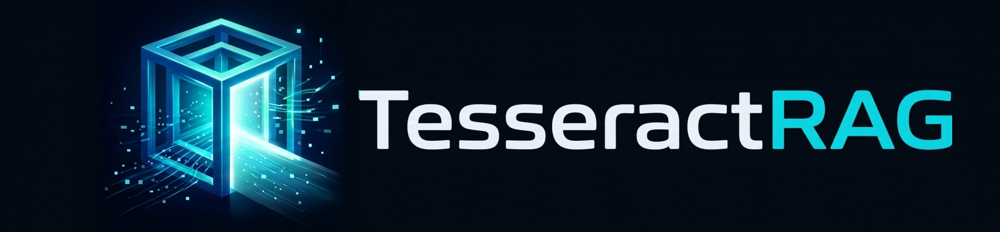

<div align="center">



**Advanced (Modular) ـــــ Adaptive Multi-Session Retrieval-Augmented Generation System**<br>
*Production-grade · Hybrid Retrieval · Anonymous Identity · Cloud-Native*<br>

> *Built as a deliberate learning project — every component designed, debugged, and understood from first principles.*
> *The name comes from the tesseract — a four-dimensional hypercube — representing the multi-dimensional retrieval space:*
> ***lexical**, **semantic**, **contextual**, and **temporal** dimensions intersecting to produce accurate, grounded answers.*

---

**imagesss**
**imagesss**
**imagesss**

<br/>

[](https://python.org)
[](https://fastapi.tiangolo.com)
[](https://github.com/facebookresearch/faiss)
[](https://www.backblaze.com/b2)
[](https://workers.cloudflare.com)
[](https://railway.app)
[](LICENSE)
[]()


</div>

---

## Why TesseractRAG?

TesseractRAG started as a question: *what does it actually take to build a production-grade RAG system from scratch?*

Not a tutorial. Not a framework wrapper. A real system — with a proper ingestion pipeline, hybrid retrieval, reranking, persistent multi-session state, and cloud-native deployment — built and understood component by component.

Most RAG demos are single-session toys: upload one document, ask one question, lose everything on refresh. TesseractRAG solves this by treating each conversation as a **fully isolated RAG environment** — its own vector index, lexical index, document store, and conversation history — that persists across page refreshes, backend restarts, and redeployments, with no login required.

---

## Table of Contents

- [Live Demo](#live-demo)
- [Core Capabilities](#core-capabilities)
- [Architecture Overview](#architecture-overview)
- [How It Works](#how-it-works)
  - [Document Ingestion Pipeline](#document-ingestion-pipeline)
  - [Retrieval Pipeline](#retrieval-pipeline)
  - [Generation Layer](#generation-layer)
  - [Anonymous Identity System](#anonymous-identity-system)
- [Tech Stack](#tech-stack)
- [Project Structure](#project-structure)
- [Quick Start](#quick-start)
- [API Reference](#api-reference)
- [Configuration Reference](#configuration-reference)
- [Use Cases](#use-cases)
- [Development Phases](#development-phases)
- [Deployment](#deployment)
- [Known Limitations](#known-limitations)
- [Future Roadmap](#future-roadmap)
- [What I Learned Building This](#what-i-learned-building-this)

---

## Live Demo

| Service | URL |
|---|---|
| **Frontend** | [`https://tesseractrag.ziayd-usf.workers.dev`](https://tesseractrag.ziayd-usf.workers.dev) |
| **Backend API Docs** | `https://<your-railway-url>.railway.app/docs` |

> ⚠️ **Cold Start Notice:** The Railway backend may take 30–60 seconds to wake on first request. The frontend retries automatically — this is a free-tier constraint. Subsequent requests within the same session are fast.

---

## Core Capabilities

| Capability | What Makes It Different |
|---|---|
| **Multi-Session Isolation** | Each session owns its own FAISS index, BM25 retriever, document store, and conversation history — fully independent, zero cross-contamination |
| **Hybrid Retrieval** | BM25 lexical search + FAISS semantic search fused via Reciprocal Rank Fusion (RRF) — captures both exact keyword matches and conceptual similarity in a single unified ranking |
| **Adaptive Query Routing** | Rule-based classifier selects retrieval strategy per question — lexical for technical identifiers, semantic for conceptual questions, hybrid by default |
| **Cross-Encoder Reranking** | Retrieved candidates re-scored by `cross-encoder/ms-marco-MiniLM-L-6-v2` — joint query-passage encoding, far more precise than bi-encoder similarity alone |
| **Grounded Generation** | LLM constrained to answer only from retrieved context — hallucination is architecturally minimized, not just prompted away |
| **Anonymous Browser Identity** | Stable UUID derived from browser fingerprint — sessions persist without accounts, login, or cookies |
| **Document Deletion** | Remove individual documents from a session without rebuilding the entire knowledge base |
| **Persistent Storage** | Sessions, chunks, and FAISS indexes stored in Backblaze B2 — survive full redeployments |

---

## Architecture Overview

```
┌──────────────────────────────────────────────────────────────────────┐
│                 CLOUDFLARE WORKERS (Frontend)                        │
│          Vanilla JS · HTML/CSS · <20KB · Global Edge CDN             │
│   Session Sidebar · Document Upload · Chat Interface · Owner Badge   │
└─────────────────────────────┬────────────────────────────────────────┘
                              │  REST API  ·  X-Owner-ID header
                              │  every request carries browser UUID
┌─────────────────────────────▼────────────────────────────────────────┐
│                      RAILWAY  (FastAPI Backend)                      │
│                                                                      │
│  ┌──────────────────────────────────────────────────────────────┐    │
│  │  Session Manager  (owner-scoped)                             │    │
│  │    create · list · delete · reload from B2 on startup        │    │
│  └───────────────────────────────┬──────────────────────────────┘    │
│                                  │                                   │
│  ┌───────────────────────────────▼──────────────────────────────┐    │
│  │  Ingestion Pipeline                                          │    │
│  │    Parse → Chunk → Embed → FAISS Index → BM25 Index          │    │
│  └───────────────────────────────┬──────────────────────────────┘    │
│                                  │                                   │
│  ┌───────────────────────────────▼──────────────────────────────┐    │
│  │  Retrieval Router                                            │    │
│  │   ├── BM25 Retriever       (lexical  · rank-bm25)            │    │
│  │   ├── FAISS Retriever      (semantic · bge-small-en-v1.5)    │    │
│  │   └── RRF Fusion  ──►  Cross-Encoder Reranker                │    │
│  │                           (ms-marco-MiniLM-L-6-v2)           │    │
│  └───────────────────────────────┬──────────────────────────────┘    │
│                                  │                                   │
│  ┌───────────────────────────────▼──────────────────────────────┐    │
│  │  Generation Layer                                            │    │
│  │   Context Builder → Prompt Builder → HF LLM Client           │    │
│  │                      (Llama-3.1-8B-Instruct via HF Router)   │    │
│  └──────────────────────────────────────────────────────────────┘    │
└──────────────────────────────────┬───────────────────────────────────┘
                                   │  boto3 · S3-compatible API
┌──────────────────────────────────▼───────────────────────────────────┐
│                       BACKBLAZE B2  (Storage)                        │
│   sessions/{id}/metadata.json   ← identity · messages · doc names    │
│   sessions/{id}/chunks.json     ← all text chunks with metadata      │
│   sessions/{id}/faiss.index     ← serialised FAISS binary index      │
└──────────────────────────────────────────────────────────────────────┘
```

**Pattern:** Two-tier service-oriented  
**Communication:** REST API over HTTP/JSON  
**Identity:** Anonymous browser UUID via `X-Owner-ID` header — no auth server required  
**State:** Server-side in-memory + Backblaze B2 for cross-restart persistence

---

## How It Works

### Document Ingestion Pipeline

Every upload triggers a stateless, sequential pipeline. Each stage is independently testable.

```
Upload → Parse → Chunk → Embed → FAISS Index → BM25 Index → Persist to B2
```

| Stage | Module | Detail |
|---|---|---|
| **Parse** | `ingestion/parser.py` | Extracts raw text from PDF, TXT, MD. Files processed in-memory via `io.BytesIO` — never touch server disk. |
| **Chunk** | `ingestion/chunker.py` | `RecursiveChunker` splits on paragraph → sentence → word boundaries. 512-char chunks, 64-char overlap. Chunks under 50 chars discarded as noise. |
| **Embed** | `ingestion/embedder.py` | `BAAI/bge-small-en-v1.5` encodes chunks into L2-normalised float32 vectors. Asymmetric design: query prefix differs from passage prefix — a subtle detail that silently kills retrieval quality if missed. |
| **FAISS Index** | `ingestion/indexer.py` | `IndexFlatIP` — exact cosine similarity via dot product on normalised vectors. Per-session, fully isolated. |
| **BM25 Index** | `retrieval/bm25_retriever.py` | `BM25Okapi` stateless-rebuilt over all session chunks on each upload. No incremental update — full rebuild is fast enough at this scale. |
| **Persist** | `session_manager.py` | FAISS binary + chunks JSON + metadata → Backblaze B2. Three separate writes, all required. Skipping any one causes partial corruption after restart. |

---

### Retrieval Pipeline

Every question passes through four stages before reaching the LLM.

```
Question → Router → BM25 + FAISS → RRF Fusion → Cross-Encoder Rerank → Top-K Chunks
```

**Retrieval Router** — rule-based query classifier (zero ML cost):

| Condition | Strategy | Rationale |
|---|---|---|
| Short query (≤3 words) with acronym / version / error code | Lexical (BM25) | Exact token matching wins on technical identifiers |
| Long query (>5 words) starting with *what is*, *explain*, *describe* | Semantic (FAISS) | Embedding space captures conceptual meaning |
| Default / ambiguous | Hybrid (RRF) | Best average performance — safe fallback |
| User manual override | As selected | User controls via UI dropdown |

**Reciprocal Rank Fusion (RRF)** discards raw scores entirely — it fuses by rank position:

```
RRF Score(doc) = Σ 1 / (k + rank(doc, list_i))    k = 60  (Cormack et al., 2009)
```

BM25 scores and FAISS scores live on incompatible scales. RRF bypasses the scale problem completely. Documents ranking highly in *both* lists win. Documents in only one list still receive partial credit — no signal is discarded.

**Cross-Encoder Reranker** (`cross-encoder/ms-marco-MiniLM-L-6-v2`) jointly encodes each (query, chunk) pair through a single transformer pass. Unlike the bi-encoder used for retrieval — which encodes query and chunks independently — the cross-encoder lets every query token attend to every chunk token. Far more accurate, but too slow to run on all chunks. Runs only on the top-10 pre-filtered candidates — precision where it matters, speed everywhere else.

---

### Generation Layer

| Component | Responsibility |
|---|---|
| **Context Builder** | Deduplicates chunks by MD5 hash — BM25 and FAISS may independently retrieve the same chunk. Formats with source attribution. Enforces 3,000-char context budget (~750 tokens). |
| **Prompt Builder** | Multi-turn prompt: system instruction (answer only from context, admit when information is missing) + last 3 conversation exchanges + formatted context + current question. History saved *after* generation — prevents orphaned history from mid-generation failures. |
| **LLM Client** | Async `httpx` → HuggingFace Inference Router → `meta-llama/Llama-3.1-8B-Instruct`. `temperature=0.1` for near-deterministic factual output. 503 warm-up handled with exponential retry logic. |

---

### Anonymous Identity System

```
First visit  →  crypto.randomUUID()  →  stored in localStorage as "tr_owner_id"
Every request  →  X-Owner-ID: <uuid>  header attached automatically
Backend  →  filters sessions by owner_id  →  other browsers' sessions invisible
Session created  →  owner_id stored in metadata.json in B2
Backend restart  →  sessions reload with their owner_id  →  ownership survives
```

The identity is stable across page refreshes and backend restarts without requiring any account or server-side session. Clearing `localStorage` resets identity — a documented tradeoff. The `owner_id` field is already present in the data model, making a JWT auth layer a clean drop-in replacement when needed.

---

## Tech Stack

| Layer | Technology | Why |
|---|---|---|
| **Frontend** | Vanilla JS + HTML/CSS on Cloudflare Workers | Zero framework overhead · global edge CDN · no cold starts · <20KB total |
| **Backend API** | FastAPI + Uvicorn | High-performance async · auto OpenAPI docs · Pydantic v2 validation |
| **Embeddings** | `BAAI/bge-small-en-v1.5` | Top MTEB ranking · 33M params · CPU-friendly · asymmetric retrieval design |
| **Vector Index** | FAISS `IndexFlatIP` | Sub-millisecond exact search · CPU-only · per-session isolation |
| **Lexical Search** | `rank-bm25` BM25Okapi | Industry-standard · zero latency · strong complement to semantic search |
| **Reranker** | `cross-encoder/ms-marco-MiniLM-L-6-v2` | Lightweight cross-encoder · MS MARCO trained · strong passage relevance precision |
| **LLM** | Llama-3.1-8B-Instruct via HF Router | Free inference · strong instruction following · open weights |
| **Storage** | Backblaze B2 (S3-compatible via boto3) | 10GB free tier · survives redeployments · no vendor lock-in |
| **Backend Hosting** | Railway | Docker deploy · auto-deploys from `main` on push |
| **Frontend Hosting** | Cloudflare Workers | Global edge · free tier · instant deploys |

---

## Project Structure

```
tesseractrag/
│
├── backend/
│   ├── app/
│   │   ├── main.py                  # FastAPI entry point · CORS · lifespan
│   │   ├── config.py                # Pydantic Settings — env var loading
│   │   ├── dependencies.py          # Singleton injection · get_owner_id()
│   │   │
│   │   ├── api/v1/
│   │   │   ├── sessions.py          # POST / GET / DELETE sessions
│   │   │   ├── documents.py         # POST / GET / DELETE documents
│   │   │   └── chat.py              # POST chat — full RAG pipeline
│   │   │
│   │   ├── core/
│   │   │   ├── session_manager.py   # Owner-scoped session registry + B2 persistence
│   │   │   │
│   │   │   ├── storage/
│   │   │   │   └── b2_storage.py    # Backblaze B2 client (S3-compatible via boto3)
│   │   │   │
│   │   │   ├── ingestion/
│   │   │   │   ├── parser.py        # PDF / TXT / MD text extraction (in-memory)
│   │   │   │   ├── chunker.py       # Recursive character splitter with overlap
│   │   │   │   ├── embedder.py      # BGE embedding model · lazy singleton
│   │   │   │   └── indexer.py       # FAISS index management
│   │   │   │
│   │   │   ├── retrieval/
│   │   │   │   ├── bm25_retriever.py    # Lexical search
│   │   │   │   ├── vector_retriever.py  # Semantic search
│   │   │   │   ├── hybrid_retriever.py  # RRF fusion
│   │   │   │   ├── reranker.py          # Cross-encoder · ms-marco-MiniLM-L-6-v2
│   │   │   │   └── router.py            # Rule-based query routing
│   │   │   │
│   │   │   └── generation/
│   │   │       ├── context_builder.py   # MD5 dedup · source attribution · budget
│   │   │       ├── prompt_builder.py    # Multi-turn prompt · history management
│   │   │       └── llm_client.py        # HF Inference Router async client
│   │   │
│   │   ├── models/
│   │   │   ├── session.py           # SessionCreate · SessionResponse
│   │   │   ├── document.py          # DocumentInfo
│   │   │   └── chat.py              # ChatRequest · ChatResponse · SourceChunk
│   │   │
│   │   └── utils/
│   │       ├── logger.py            # Structured logging
│   │       └── text_utils.py        # Text helpers
│   │
│   ├── tests/
│   │   ├── unit/                    # chunker · retrieval · context_builder
│   │   └── integration/             # sessions · documents · chat
│   │
│   ├── Dockerfile
│   ├── requirements.txt
│   ├── .env.example
│   └── .env                         # Real secrets — NEVER commit
│
├── frontend/
│   ├── index.html                   # Full app — vanilla JS, HTML/CSS, no build step
│   └── wrangler.toml                # Cloudflare Workers config
│
├── .github/workflows/
│   ├── ci.yml                       # Test on push
│   └── keepalive.yml                # Pings Railway every 10 min
│
├── docker-compose.yml               # Local dev orchestration
└── README.md
```

---

## Quick Start

### Option A — Docker Compose (Recommended)

The fastest path to a running system. ML models are pre-downloaded inside the image at build time — no runtime download latency.

```bash
# 1. Clone
git clone https://github.com/zeyadusf/tesseractrag.git
cd tesseractrag

# 2. Configure
cp backend/.env.example backend/.env
# Edit backend/.env — add HF token and B2 credentials (see Configuration Reference)

# 3. Launch
docker-compose up
```

| Service | URL |
|---|---|
| Backend API | `http://localhost:8000` |
| Interactive API Docs | `http://localhost:8000/docs` |
| Health Check | `http://localhost:8000/health` |

> First run downloads and caches ML models (~2GB). Subsequent starts use the cached image and launch in seconds.

---

### Option B — Manual (Development)

```bash
# Virtual environment
python -m venv .venv
source .venv/bin/activate          # macOS / Linux
.venv\Scripts\activate.bat         # Windows CMD

# Install in correct order (ML stack has strict dependency sequencing)
pip install numpy==1.26.4
pip install torch==2.2.2
pip install transformers==4.40.2 sentence-transformers==2.7.0
pip install faiss-cpu==1.8.0 rank-bm25==0.2.2
pip install fastapi==0.111.0 uvicorn[standard]==0.29.0 python-multipart==0.0.9
pip install pydantic==2.7.1 pydantic-settings==2.2.1 boto3==1.34.0
pip install pypdf2==3.0.1 httpx==0.27.0
pip install pytest==8.2.0 pytest-asyncio==0.23.6

# Verify no conflicts
pip check

# Run
cp backend/.env.example backend/.env
cd backend
uvicorn app.main:app --reload --port 8000
```

---

## API Reference

All endpoints are under `/api/v1/`. Every request must include `X-Owner-ID: <uuid>` — requests without it return `HTTP 400`.

### Sessions

| Method | Endpoint | Description | Status Code |
|---|---|---|---|
| `GET` | `/api/v1/sessions/` | List all sessions owned by this browser | 200 |
| `POST` | `/api/v1/sessions/` | Create a new session | 201 |
| `DELETE` | `/api/v1/sessions/{id}` | Delete session and all B2 data | 204 |

### Documents

| Method | Endpoint | Description | Status Code |
|---|---|---|---|
| `POST` | `/api/v1/sessions/{id}/documents` | Upload document (PDF/TXT/MD, max 10MB) | 201 |
| `GET` | `/api/v1/sessions/{id}/documents` | List indexed documents + chunk counts | 200 |
| `DELETE` | `/api/v1/sessions/{id}/documents/{filename}` | Remove a document from the session | 204 |

### Chat

| Method | Endpoint | Description | Status Code |
|---|---|---|---|
| `POST` | `/api/v1/sessions/{id}/chat` | Ask a question, receive a grounded answer with sources | 200 |

**Example request:**
```json
{
  "question": "What is reciprocal rank fusion?",
  "strategy": "auto",
  "show_context": true
}
```

**Example response:**
```json
{
  "answer": "Reciprocal Rank Fusion (RRF) merges ranked lists by position...",
  "sources": [
    {
      "content": "RRF score = sum(1 / (k + rank))...",
      "document_name": "survey_ir.pdf",
      "chunk_index": 47,
      "relevance_score": 0.94
    }
  ],
  "strategy_used": "hybrid",
  "retrieval_ms": 287,
  "generate_ms": 4103
}
```

---

## Configuration Reference

| Variable | Default | Description |
|---|---|---|
| `HF_API_TOKEN` | *(required)* | HuggingFace API token — `hf.co/settings/tokens` |
| `EMBEDDING_MODEL` | `BAAI/bge-small-en-v1.5` | Sentence embedding model |
| `RERANKER_MODEL` | `cross-encoder/ms-marco-MiniLM-L-6-v2` | Cross-encoder reranker |
| `LLM_MODEL` | `meta-llama/Llama-3.1-8B-Instruct` | LLM for answer generation |
| `R2_ENDPOINT_URL` | *(required)* | Backblaze B2 S3 endpoint |
| `R2_ACCESS_KEY_ID` | *(required)* | B2 application key ID |
| `R2_SECRET_ACCESS_KEY` | *(required)* | B2 application key secret |
| `R2_BUCKET_NAME` | *(required)* | B2 bucket name |
| `CHUNK_SIZE` | `512` | Max characters per text chunk |
| `CHUNK_OVERLAP` | `64` | Overlap characters between adjacent chunks |
| `FINAL_TOP_K` | `3` | Chunks passed to LLM after reranking |
| `DIM_FAISS` | `384` | Embedding dimension — must match the embedding model |
| `DEBUG` | `false` | Enable verbose logging |

> **Security:** `backend/.env` is in `.gitignore` and must never be committed. If a secret is accidentally pushed, revoke it immediately on the provider dashboard and rotate.

---

## Use Cases

- **Research Assistant** — Upload academic papers per topic; query across them with cited, chunk-level source attribution
- **Technical Documentation** — Maintain isolated knowledge bases per product, version, or service
- **Legal / Contract Review** — Session isolation prevents any cross-case context contamination
- **Study Tool** — Load course materials per subject; conversational Q&A with specific source references
- **Personal Knowledge Base** — Persistent, browser-bound sessions with no account creation required

---

## Development Phases

Each phase was approached as a deliberate learning milestone — system design first, implementation second, documentation always.

| Phase | Name | Status | Key Deliverable |
|---|---|---|---|
| **0** | Environment Setup | ✅ Complete | Config · Logger · venv · project structure |
| **1** | FastAPI Skeleton | ✅ Complete | Running server · `/health` · Pydantic models |
| **2** | Session Management | ✅ Complete | Create · list · delete · B2 persistence · startup reload |
| **3** | Document Ingestion | ✅ Complete | Parse → Chunk → Embed → FAISS + BM25 |
| **4** | Retrieval Pipeline | ✅ Complete | Hybrid RRF · cross-encoder reranking · adaptive router |
| **5** | Generation Layer | ✅ Complete | Context builder · prompt builder · LLM client · chat endpoint |
| **6** | Frontend + Identity | ✅ Complete | Cloudflare Workers UI · anonymous browser identity |
| **7** | Docker & Deployment | ✅ Complete | Dockerfiles · docker-compose · Railway · Cloudflare deploy |

---

## Deployment

### Infrastructure

| Component | Platform | Notes |
|---|---|---|
| **Backend** (FastAPI) | Railway | Docker deploy · auto-deploys from `main` on push |
| **Frontend** | Cloudflare Workers | Global edge CDN · zero cold starts · free tier |
| **Storage** | Backblaze B2 | S3-compatible · 10GB free · sessions survive redeployments |
| **ML Models** | Baked into Docker image | Downloaded at build time — no runtime download latency |


---

## Known Limitations

| Limitation | Cause | Status |
|---|---|---|
| 30–60s cold start | Railway free tier spins down on inactivity | Mitigated by GitHub Actions keepalive |
| Session loss on localStorage clear | Anonymous identity stored client-side | Documented tradeoff — JWT auth in roadmap |
| ~1,000 HF API requests/day | Free tier inference limit | Acceptable for portfolio use |
| FAISS not GPU-accelerated | CPU-only constraint on free tier | Sufficient for <10,000 chunks per session |
| Text-only documents | v1.0 scope | Multimodal RAG planned for v2.0 |

---

## Future Roadmap

### v1.x — Evaluation & Hardening
- [ ] RAGAS evaluation suite — faithfulness, context precision, answer relevancy
- [ ] Query rewriting with FLAN-T5 before retrieval
- [ ] Token-based JWT authentication
- [ ] SSE streaming LLM responses — token-by-token output
- [ ] DOCX and HTML file format support

### v2.0 — Multimodal RAG
- [ ] Image extraction from PDFs via PyMuPDF
- [ ] Image understanding via LLaVA / BLIP-2
- [ ] Multimodal embeddings (CLIP) — unified text + image retrieval space

### v2.x — Scale & Intelligence
- [ ] Knowledge graph integration — entity extraction for graph-augmented retrieval
- [ ] Fine-tuned retrieval router — replace rule-based classifier with a trained model
- [ ] PostgreSQL-backed session storage for multi-user production
- [ ] Ollama integration — fully local LLM, zero HF API dependency
- [ ] Answer feedback loop — user ratings stored for future fine-tuning

---

## What I Learned Building This

The engineering concepts this project forced me to understand — not just use:

- Why BM25 and FAISS scores are incompatible and why RRF solves this by ignoring scores entirely
- The bi-encoder vs. cross-encoder tradeoff: speed at retrieval, precision at reranking
- Why `normalize_embeddings=True` is non-negotiable for `IndexFlatIP` (cosine = dot product on unit vectors)
- Why query and passage embeddings use different prefixes in asymmetric retrieval models (BGE)
- Why the FAISS index and chunk list must always be extended together — separate operations cause silent data corruption
- Why BM25 must be rebuilt from scratch on every upload (no incremental update in `rank_bm25`)
- Why history is saved after generation, not before — mid-crash orphaned history is harder to debug than a lost message
- Anonymous identity without an auth server — and where that design breaks down

---

## Author

<div align="center">

**Zeyad Yousif** — AI Engineer (Learning in Public)

[](https://github.com/zeyadusf)

*TesseractRAG is a learning project built under senior engineering mentorship.*
*Every component was designed to be understood, not just to work.*

</div>

---

<div align="center">

*TesseractRAG — Because understanding how something works is more valuable than having it work.*

</div>
