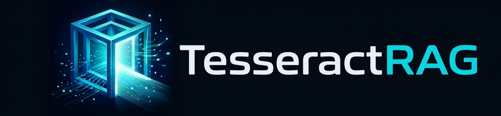
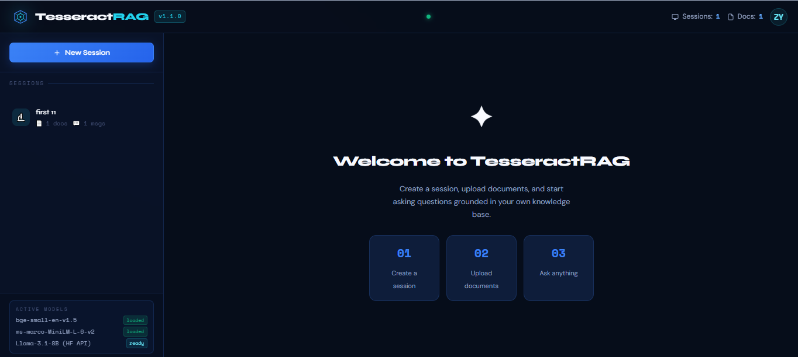
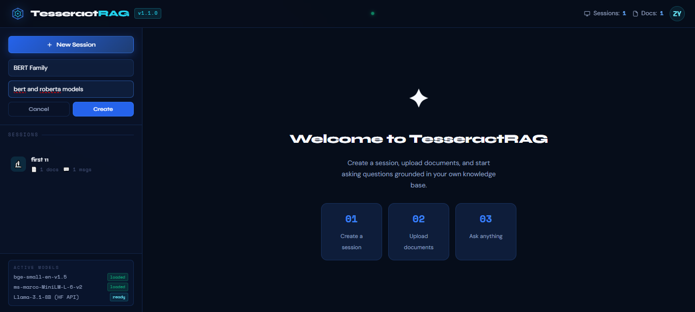
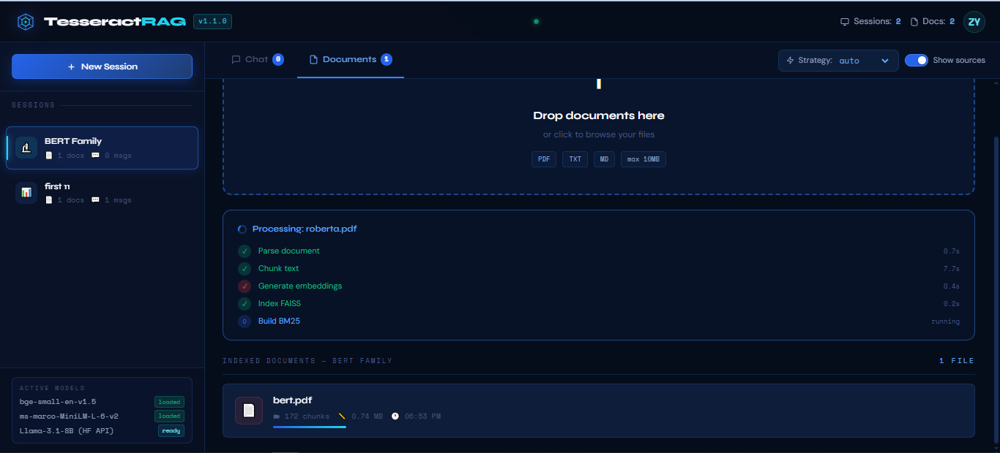
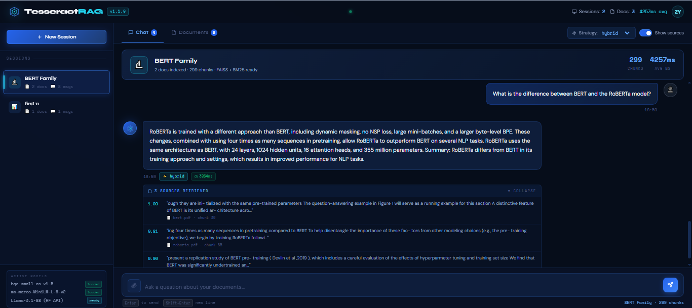
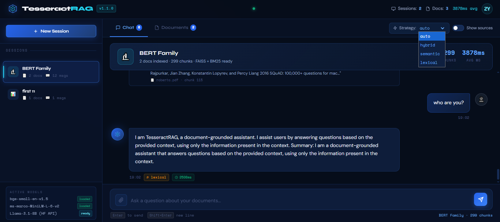
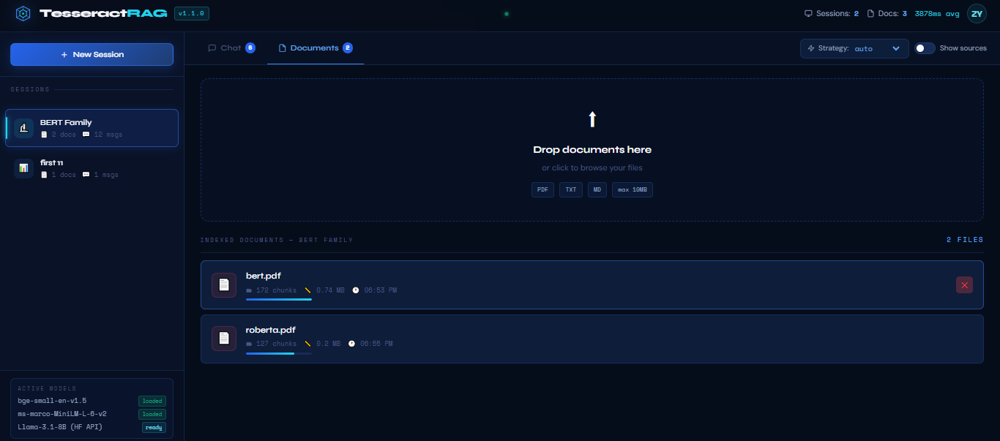
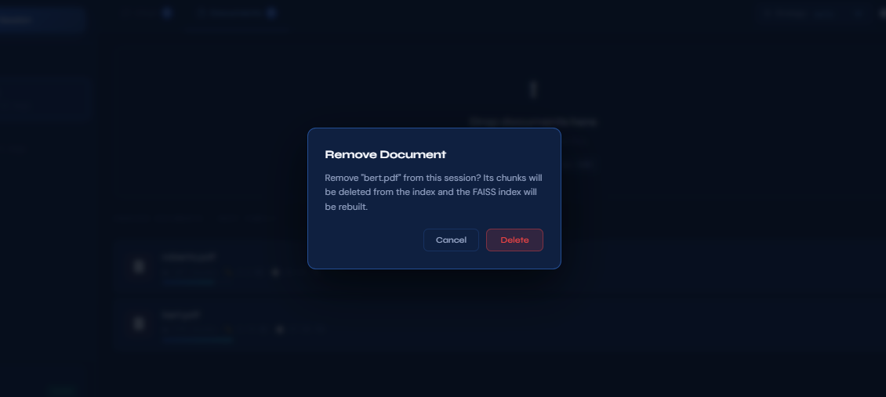
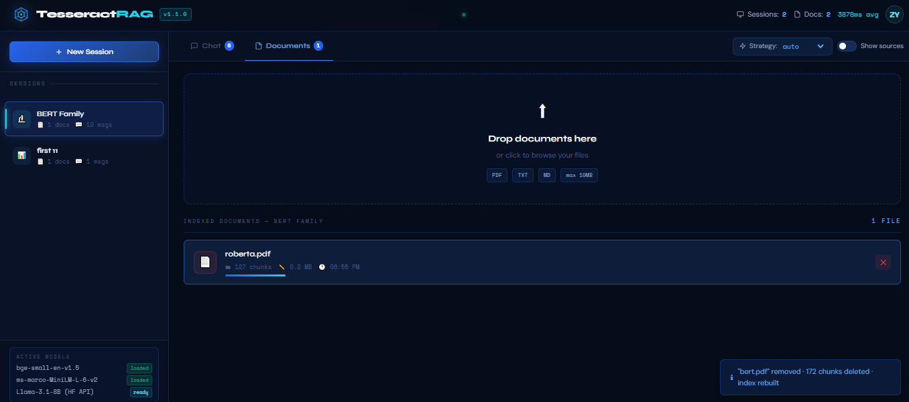
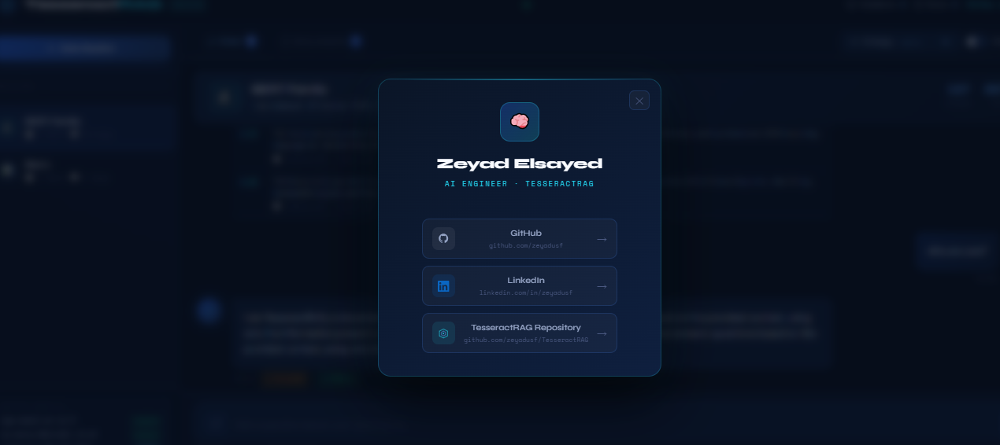

<div align="center">



**Advanced · Modular · Adaptive Multi-Session Retrieval-Augmented Generation System**<br>
*Production-grade · Hybrid Retrieval · Auth + Guest Identity · PostgreSQL + pgvector · Cloud-Native*<br>

> *Built as a deliberate learning project — every component designed, debugged, and understood from first principles.*
> *The name comes from the tesseract — a four-dimensional hypercube — representing the multi-dimensional retrieval space:*
> ***lexical**, **semantic**, **contextual**, and **temporal** dimensions intersecting to produce accurate, grounded answers.*

---
<!--
<details>
<summary><strong>📸 Screenshots — click to expand</strong></summary>
<br>

| | |
|---|---|
|  |  |
|  |  |
|  |  |
|  |  |
|  | |

</details>

<br/>

[](https://python.org)
[](https://fastapi.tiangolo.com)
[](https://github.com/pgvector/pgvector)
[](https://groq.com)
[](https://redis.io)
[](https://docker.com)
[](LICENSE)
[]()


---
-->
</div>

## What is TesseractRAG?

TesseractRAG started as a question: *what does it actually take to build a production-grade RAG system from scratch?*

Not a tutorial. Not a framework wrapper. A real system — with a proper ingestion pipeline, hybrid retrieval, reranking, persistent multi-session state, and a clean layered architecture — built and understood component by component.

**v2.0** is a ground-up architectural redesign. Where v1 was a proof of concept with flat modules and file-based storage, v2 is a production-structured system: layered services, abstract base classes, dispatcher routing, PostgreSQL + pgvector replacing FAISS + Backblaze B2, JWT authentication alongside anonymous guest access, and Groq as the primary LLM provider.

---

## Table of Contents

- [Live Demo](#live-demo)
- [What's New in v2.0](#whats-new-in-v20)
- [Core Capabilities](#core-capabilities)
- [Architecture Overview](#architecture-overview)
- [How It Works](#how-it-works)
  - [Ingestion Pipeline](#ingestion-pipeline)
  - [Retrieval Pipeline](#retrieval-pipeline)
  - [Generation Layer](#generation-layer)
  - [Identity & Auth System](#identity--auth-system)
- [Tech Stack](#tech-stack)
- [Project Structure](#project-structure)
- [Quick Start](#quick-start)
- [API Reference](#api-reference)
- [Configuration Reference](#configuration-reference)
- [Migrating from v1](#migrating-from-v1)
- [Development Phases](#development-phases)
- [Known Limitations](#known-limitations)
- [Future Roadmap](#future-roadmap)
- [What I Learned Building This](#what-i-learned-building-this)

---

## [`Live Demo`](https://tesseractrag.ziayd-usf.workers.dev)

> ⚠️ **Cold Start Notice:** The backend may take 30–60 seconds to wake on first request. The frontend retries automatically — this is a free-tier constraint. Subsequent requests are fast.

---


##  What's New in v2.0

v2.0 is not an incremental update — it's a full architectural redesign built on lessons learned from v1.

### Storage & Persistence
| | v1 | v2 |
|---|---|---|
| **Vector Storage** | FAISS (in-memory, file-serialized) | pgvector (PostgreSQL extension) |
| **Document/Chunk Storage** | JSON files on Backblaze B2 | PostgreSQL via SQLAlchemy + Alembic |
| **Session Metadata** | `metadata.json` per session on B2 | PostgreSQL relational schema |
| **Embeddings** | FAISS binary index per session | `pgvector` `VECTOR` columns with cosine/L2 ops |

### Architecture
| | v1 | v2 |
|---|---|---|
| **Code Structure** | Flat modules per concern | Layered: API → Services → RAG Components → Storage |
| **RAG Components** | Direct function calls in endpoints | Abstract base classes + Dispatcher routing |
| **LLM Provider** | HuggingFace Inference Router | Groq (primary) + HF (fallback) |
| **DB Migrations** | None (manual schema) | Alembic versioned migrations |
| **Identity** | Anonymous browser UUID only | JWT auth + anonymous guest mode |
| **Caching** | None | Redis (rate-limit counters via `slowapi`) |

### RAG Capabilities
- **Multi-language support** — Arabic and English cleaning pipelines with automatic language detection
- **Pluggable parsers** — PDF, DOCX, and plain text via dispatcher-routed parser classes
- **Cross-language retrieval strategy** — queries can retrieve across language boundaries
- **Evaluation layer** — LLM-as-judge evaluation via Cohere, stored per session

---

## Core Capabilities

| Capability | Detail |
|---|---|
| **Multi-Session Isolation** | Each session owns its own vector space, chunk store, and conversation history — fully independent, zero cross-contamination |
| **Hybrid Retrieval** | BM25 lexical search + pgvector semantic search fused via Reciprocal Rank Fusion (RRF) |
| **Adaptive Query Routing** | Dispatcher selects retrieval strategy per query — lexical for identifiers, semantic for concepts, hybrid by default |
| **Cross-Encoder Reranking** | BGE cross-encoder re-scores top candidates with joint query-passage attention |
| **Cross-Language Retrieval** | Arabic/English queries can retrieve from mixed-language document sets |
| **Grounded Generation** | LLM constrained to retrieved context — hallucination is architecturally minimized |
| **JWT + Guest Identity** | Full user accounts with JWT auth; anonymous guest mode for frictionless access |
| **Rate Limiting** | Per-user and per-IP request throttling via `slowapi` + Redis — counters stored in Redis |
| **Evaluation** | Async LLM-as-judge evaluation (Cohere) runs in background after each chat turn |

---

## Architecture Overview

```
┌──────────────────────────────────────────────────────────────────────┐
│                         Frontend                                     │
│              Vanilla JS · HTML/CSS · Cloudflare Workers              │
└─────────────────────────────┬────────────────────────────────────────┘
                              │  REST API  ·  JWT / Guest token
┌─────────────────────────────▼────────────────────────────────────────┐
│                    FastAPI Backend                                   │
│                                                                      │
│   api/v1/  ──►  auth · chat · documents · sessions · admin           │
│                      │                                               │
│              services/ (business logic layer)                        │
│    auth_service · chat_service · document_service · session_service  │
│                      │                                               │
│              rag/pipelines/                                          │
│    IngestionPipeline · RetrievalPipeline · GenerationPipeline        │
│                      │                                               │
│              rag/components/  (abstract base + dispatcher)           │
│    parsing  ·  chunking  ·  cleaning  ·  embedding                   │
│    retrievals  ·  reranker  ·  generator  ·  evaluators              │
│    query_rewrite  ·  context  ·  lang_detector                       │
│                      │                                               │
│              storage/                                                │
│    db/ (PostgreSQL · SQLAlchemy · Alembic · Repositories)            │
│    vector_db/ (pgvector · FAISS fallback)                            │
│    blob/ (pluggable blob storage factory)                            │
└──────────────────────┬───────────────────────────────────────────────┘
                       │
         ┌─────────────┼──────────────┐
         ▼             ▼              ▼
   PostgreSQL        Redis        Groq API
   + pgvector    (rate limit)  (LLM inference)
```

**Pattern:** Layered service-oriented with dispatcher-routed RAG components  
**Abstractions:** Every RAG component (`parser`, `embedder`, `chunker`, `generator`, etc.) is an abstract base class — new providers are drop-in additions  
**Communication:** REST API over HTTP/JSON  
**Identity:** JWT (registered users) + anonymous guest UUID  
**State:** PostgreSQL for all persistence — no more file-based storage  
**Rate Limiting:** Redis stores `slowapi` counters — not used for response caching

---

## How It Works

### Ingestion Pipeline

Every upload is routed through `IngestionPipeline`, which orchestrates:

```
Upload → Parse → Detect Language → Clean → Chunk → Embed → Store (pgvector + Postgres)
```

| Stage | Component | Detail |
|---|---|---|
| **Parse** | `ParseDispatcher` → `PdfParser / DocxParser / TextParser` | File type detected at dispatch time — each parser extends `BaseParser`. Processed in-memory, never written to disk. |
| **Language Detection** | `LangDetector` | Detects Arabic vs. English at the document level — drives the cleaning pipeline selection. |
| **Clean** | `CleanDispatcher` → `ar_clean / en_clean` | Language-specific text normalization. Arabic: diacritic removal, Unicode normalization. English: whitespace, encoding artifacts. |
| **Chunk** | `ChunkDispatcher` → `RecursiveChunker` | Recursive character splitting with configurable size and overlap. Extends `BaseChunker` — swap strategies without touching the pipeline. |
| **Embed** | `EmbedDispatcher` → `JinaEmbedder` | Chunks encoded to dense vectors via the configured embedding provider. Extends `BaseEmbedder`. |
| **Store** | `pgvector_store` + `chunk_repo` + `embedding_repo` | Vectors stored in PostgreSQL `pgvector` columns. Chunks and metadata in relational tables. Full ACID semantics. |

---

### Retrieval Pipeline

Every query passes through `RetrievalPipeline`:

```
Query → Rewrite → Detect Language → Route → BM25 + pgvector → RRF Fusion → Rerank → Top-K
```

**Query Rewriting** (`GroqQueryRewriter` extending `QueryBase`) — reformulates the user's question before retrieval for better recall.

**Retrieval Router** routes to one of:

| Strategy | User-selectable | Condition | Rationale |
|---|---|---|---|
| `auto` | ✅ | Default | Router picks the best strategy per query |
| `hybrid` | ✅ | Explicit request | BM25 + pgvector fused via RRF |
| `semantic` | ✅ | Long conceptual query | Embedding space captures meaning |
| `lexical` | ✅ | Short query / acronym / error code | Exact token matching on technical identifiers |
| Cross-Language | ❌ internal only | Query language ≠ document language | Overrides the selected strategy to `semantic` — embeddings are language-agnostic, BM25 is not |

**RRF Fusion** discards raw scores — fuses by rank position only:

```
RRF Score(doc) = Σ 1 / (k + rank(doc, list_i))    k = 60
```

BM25 and pgvector scores live on incompatible scales. RRF bypasses the problem entirely.

**Reranking** — BGE cross-encoder jointly encodes (query, chunk) pairs through a single transformer forward pass. Runs only on the pre-filtered top candidates — precision where it matters, speed everywhere else.

---

### Generation Layer

`GenerationPipeline` orchestrates:

```
Top-K Chunks → Context Builder → Prompt Builder → GeneratorDispatcher → Answer
```

| Component | Detail |
|---|---|
| **Context Builder** | Deduplicates by MD5 hash, applies source attribution, enforces token budget (`MAX_CONTEXT_CHARS=4000`) |
| **Prompt Builder** | Multi-turn prompt: system instruction + last N exchanges + context + current query |
| **SmartGuard** (`DEFAULT_GENERATOR_PROVIDER`) | Orchestrates provider selection using Redis to track daily Groq request count (resets at UTC midnight). Three zones: **below soft threshold (80%)** → always Groq; **between soft and hard threshold (80–100%)** → round-robin between Groq and HF alternating each request; **at hard limit (100%)** → always HF. On any provider exception, automatically retries with the other provider before returning a graceful error message. |
| **GroqGenerator** | Primary provider — `llama-3.3-70b-versatile`, low latency, free tier |
| **HFGenerator** | Fallback provider — `Llama-3.1-8B-Instruct` via HuggingFace Inference Router |
| **Evaluation** | `EvaluationDispatcher` → `CohereEvaluator` — LLM-as-judge runs asynchronously after generation; scores faithfulness, answer relevancy, context precision, context recall |

---

### Identity & Auth System

v2 ships two identity modes that coexist in the same system:

**Registered Users (JWT)**
```
POST /auth/register  →  hashed password stored in users table
POST /auth/login     →  JWT access token returned
All protected endpoints  →  Bearer <token> in Authorization header
```

**Anonymous Guests**
```
First request  →  stable UUID derived from browser fingerprint  →  stored in localStorage
Every request  →  X-Owner-ID: <uuid> header
Backend  →  GuestService creates/fetches guest record in users table
Sessions  →  scoped to guest UUID, invisible to other browsers
```

The two modes share the same session and document data model — upgrading a guest to a registered account is a clean migration path.

---

## Tech Stack

| Layer | Technology | Why |
|---|---|---|
| **Backend API** | FastAPI + Uvicorn | Async-first · auto OpenAPI docs · Pydantic v2 |
| **Database** | PostgreSQL + SQLAlchemy + Alembic | ACID semantics · versioned migrations · repository pattern |
| **Vector Storage** | pgvector | Vectors co-located with relational data — no separate vector DB to operate |
| **Rate Limit State** | Redis | Stores rate-limit counters via `slowapi` — not used for response caching |
| **Embeddings** | Jina Embedder (via `EmbedDispatcher`) | Pluggable — swap models without touching pipelines |
| **Lexical Search** | BM25 (`rank-bm25`) | Zero latency · strong complement to semantic search |
| **Reranker** | BGE cross-encoder | Joint query-passage attention · strong passage relevance precision |
| **LLM (Primary)** | Groq API | Low-latency inference · free tier · strong instruction following |
| **LLM (Fallback)** | HuggingFace Inference Router | Redundancy — same `GeneratorBase` interface |
| **Evaluation** | Cohere (LLM-as-judge) | No OpenAI dependency — faithfulness + relevancy scoring |
| **Auth** | JWT (PyJWT) + bcrypt | Industry-standard · stateless tokens |
| **Rate Limiting** | `slowapi` | Per-IP and per-user limits at the API layer |
| **Frontend** | Vanilla JS + HTML/CSS on Cloudflare Workers | Zero framework overhead · global edge CDN · no cold starts |
| **Containerization** | Docker + Docker Compose | Postgres + pgvector + Redis + backend in one `up` command |

---

## Project Structure

```
TesseractRAG/
│
├── backend/
│   ├── api/
│   │   ├── main.py                      # FastAPI entry point · CORS · lifespan
│   │   └── v1/
│   │       ├── auth.py                  # Register · login · token refresh
│   │       ├── chat.py                  # POST chat — full RAG pipeline
│   │       ├── documents.py             # Upload · list · delete documents
│   │       ├── sessions.py              # Create · list · delete sessions
│   │       ├── evaluation.py            # Retrieve async evaluation results
│   │       └── admin.py                 # Superuser management endpoints
│   │
│   ├── core/
│   │   ├── config.py                    # Pydantic Settings — env var loading
│   │   ├── dependencies.py              # FastAPI dependency injection
│   │   ├── limiter.py                   # slowapi rate limiter config
│   │   ├── logger.py                    # Structured logging
│   │   └── security/
│   │       ├── jwt.py                   # Token generation and validation
│   │       ├── jwt_deps.py              # FastAPI JWT dependencies
│   │       ├── password.py              # bcrypt hashing utilities
│   │       └── seed_superuser.py        # Initial superuser creation on startup
│   │
│   ├── models/                          # Pydantic request/response models
│   │   ├── auth.py · chat.py · documents.py · sessions.py
│   │   ├── embedding.py · evaluation.py · metadata.py
│   │   ├── admin.py · healthStatus.py
│   │   └── enums/                       # Typed enums for strategies, roles, statuses
│   │       ├── retrieval_strategy.py    # LEXICAL · SEMANTIC · HYBRID · CROSS_LANGUAGE
│   │       ├── embedding_enum.py
│   │       ├── doc_status.py
│   │       ├── evaluation_enum.py
│   │       ├── message_role.py
│   │       ├── generator_prompts.py
│   │       └── query_prompts.py
│   │
│   ├── rag/
│   │   ├── pipelines/
│   │   │   ├── ingestion_pipeline.py    # Parse → Clean → Chunk → Embed → Store
│   │   │   ├── retrieval_pipeline.py    # Rewrite → Route → Retrieve → Rerank
│   │   │   └── generation_pipeline.py  # Context → Prompt → Generate → Evaluate
│   │   │
│   │   └── components/
│   │       ├── lang_detector.py         # Arabic / English detection
│   │       ├── parsing/
│   │       │   ├── base_parser.py       # Abstract BaseParser
│   │       │   ├── parse_dispatcher.py  # Routes by file extension
│   │       │   └── parsers/
│   │       │       ├── PdfParser.py
│   │       │       ├── DocxParser.py
│   │       │       └── TextParser.py
│   │       ├── cleaning/
│   │       │   ├── clean_dispatcher.py  # Routes by detected language
│   │       │   ├── ar_clean.py          # Arabic normalization
│   │       │   └── en_clean.py          # English normalization
│   │       ├── chunking/
│   │       │   ├── base_chunker.py      # Abstract BaseChunker
│   │       │   ├── chunk_dispatcher.py
│   │       │   └── recursive_chunker/RecursiveChunker.py
│   │       ├── embedding/
│   │       │   ├── base_embedder.py     # Abstract BaseEmbedder
│   │       │   ├── embed_dispatcher.py
│   │       │   └── providers/jina_embedder.py
│   │       ├── retrievals/
│   │       │   ├── bm25_retrieval.py
│   │       │   ├── hybrid_retrieval.py  # RRF fusion
│   │       │   ├── cross_language_strategy.py
│   │       │   └── retrieval_router.py  # Strategy dispatcher
│   │       ├── reranker/
│   │       │   └── bge_hf.py            # BGE cross-encoder
│   │       ├── generator/
│   │       │   ├── generator_base.py    # Abstract GeneratorBase
│   │       │   ├── generator_dispatcher.py
│   │       │   ├── groq_generator.py    # Primary LLM provider
│   │       │   ├── hf_generator.py      # Fallback LLM provider
│   │       │   └── guard.py             # SmartGuard: 3-zone logic (Groq → round-robin → HF) tracked via Redis daily counter
│   │       ├── query_rewrite/
│   │       │   ├── query_base.py        # Abstract QueryBase
│   │       │   ├── query_dispatcher.py
│   │       │   └── groq_query_rewriter.py
│   │       ├── evaluators/
│   │       │   ├── base_evaluator.py    # Abstract BaseEvaluator
│   │       │   ├── evaluation_dispatcher.py
│   │       │   └── cohere_evaluator.py  # LLM-as-judge
│   │       └── context/
│   │           └── context_builder.py   # MD5 dedup · source attribution · budget
│   │
│   ├── services/                        # Business logic layer
│   │   ├── base_service.py              # Abstract BaseService
│   │   ├── auth_service.py
│   │   ├── chat_service.py
│   │   ├── document_service.py
│   │   ├── session_service.py
│   │   ├── evaluation_service.py
│   │   ├── admin_service.py
│   │   ├── guest_service.py             # Anonymous guest lifecycle
│   │   └── exceptions.py               # Typed domain exceptions
│   │
│   ├── storage/
│   │   ├── db/
│   │   │   ├── postgres/
│   │   │   │   ├── postgres_provider.py
│   │   │   │   ├── repo_factory.py      # Repository factory
│   │   │   │   ├── repositories/        # One repo per domain entity
│   │   │   │   │   ├── base_repo.py     # Abstract BaseRepository
│   │   │   │   │   ├── user_repo.py · session_repo.py · document_repo.py
│   │   │   │   │   ├── chunk_repo.py · embedding_repo.py · message_repo.py
│   │   │   │   │   └── evaluation_repo.py
│   │   │   │   ├── schemas/             # SQLAlchemy ORM models
│   │   │   │   │   ├── sqlalchemy_base.py
│   │   │   │   │   ├── user.py · session.py · document.py · chunk.py
│   │   │   │   │   ├── embedding.py · message.py · evaluation.py
│   │   │   │   └── alembic/             # Versioned DB migrations
│   │   │   │       └── versions/
│   │   │   ├── db_dispatcher.py
│   │   │   └── session_dispatcher.py
│   │   ├── vector_db/
│   │   │   ├── base.py                  # Abstract VectorStore
│   │   │   ├── vec_dispatcher.py
│   │   │   ├── pgvector/pgvector_store.py   # Primary vector backend
│   │   │   └── faiss/faiss_store.py         # Fallback / local dev
│   │   └── blob/
│   │       └── factory.py               # Pluggable blob storage factory
│   │
│   └── docker/
│       ├── Dockerfile
│       ├── init.sql                     # pgvector extension bootstrap
│       └── .env.example
│
├── Frontend/
│   ├── index.html                       # Vanilla JS app — no build step
│   └── wrangler.jsonc                   # Cloudflare Workers config
│
├── docker-compose.yml                   # Postgres + pgvector + Redis + backend
├── requirements.txt
├── .env.example
└── LICENSE
```

---

## Quick Start

### Option A — Docker Compose (Recommended)

```bash
# 1. Clone
git clone https://github.com/zeyadusf/tesseractrag.git
cd tesseractrag

# 2. Configure
cp backend/docker/.env.example backend/docker/.env
# Fill in GROQ_API_KEY, COHERE_API_KEY, JWT_SECRET_KEY (see Configuration Reference)

# 3. Launch (Postgres + pgvector + Redis + backend)
docker-compose up
```

Docker Compose will:
- Start PostgreSQL with the pgvector extension (via `init.sql`)
- Start Redis
- Start the FastAPI backend
- Run Alembic migrations automatically on startup
- Seed the superuser account

| Service | URL |
|---|---|
| Backend API | `http://localhost:8000` |
| Interactive API Docs | `http://localhost:8000/docs` |
| Health Check | `http://localhost:8000/health` |

---

### Option B — Manual (Development)

```bash
# Prerequisites: PostgreSQL 15+ with pgvector, Redis

# Virtual environment
python -m venv .venv
source .venv/bin/activate         # macOS / Linux
.venv\Scripts\activate.bat        # Windows CMD

# Install dependencies
pip install -r requirements.txt

# Configure
cp backend/docker/.env.example .env
# Edit .env — add DB connection string, Groq/Cohere keys, JWT secret

# Run migrations
cd backend/storage/db/postgres
alembic upgrade head

# Start
cd backend
uvicorn api.main:app --reload --port 8000
```

---

## API Reference

All endpoints are under `/api/v1/`. Every protected endpoint requires `Authorization: Bearer <token>` (OAuth2 password flow). The full interactive spec is available at `http://localhost:8000/docs` when running.

### Auth

| Method | Endpoint | Description | Auth |
|---|---|---|---|
| `POST` | `/api/v1/auth/register` | Register — returns `TokenPair` (access + refresh) | Public |
| `POST` | `/api/v1/auth/login` | Login (form: username + password) — returns `TokenPair` | Public |
| `POST` | `/api/v1/auth/refresh` | Exchange refresh token for a new `TokenPair` | Public |
| `GET` | `/api/v1/auth/me` | Get current user profile | Bearer |
| `POST` | `/api/v1/auth/me/password` | Change password | Bearer |
| `POST` | `/api/v1/auth/logout` | Logout (client discards tokens — JWT is stateless) | Bearer |

### Sessions

| Method | Endpoint | Description |
|---|---|---|
| `POST` | `/api/v1/sessions` | Create a new session (`name` required, `description` optional) |
| `GET` | `/api/v1/sessions` | List sessions (`?active_only=true` to filter) |
| `GET` | `/api/v1/sessions/{session_id}` | Get session detail |
| `PATCH` | `/api/v1/sessions/{session_id}` | Rename or update session metadata |
| `DELETE` | `/api/v1/sessions/{session_id}` | Delete session + all documents + chat history |

### Documents

| Method | Endpoint | Description |
|---|---|---|
| `POST` | `/api/v1/sessions/{session_id}/documents` | Upload and ingest a document (PDF / DOCX / TXT / MD, max 10MB) |
| `GET` | `/api/v1/sessions/{session_id}/documents` | List documents — paginated (`page`, `page_size`) |
| `GET` | `/api/v1/sessions/{session_id}/documents/{doc_id}` | Get document metadata + ingestion status (`pending` / `processing` / `indexed` / `failed`) |
| `DELETE` | `/api/v1/sessions/{session_id}/documents/{doc_id}` | Delete document and all its vector chunks |

### Chat

| Method | Endpoint | Description |
|---|---|---|
| `POST` | `/api/v1/sessions/{session_id}/chat` | Ask a question — returns grounded answer with sources, latency, and model info |
| `GET` | `/api/v1/sessions/{session_id}/chat` | List all Q&A turns — paginated |
| `GET` | `/api/v1/sessions/{session_id}/chat/{turn_id}` | Get a single chat turn by ID |
| `DELETE` | `/api/v1/sessions/{session_id}/chat` | Clear all chat history for a session |

**Example request:**
```json
{
  "question": "What is reciprocal rank fusion?",
  "strategy": "auto",
  "show_context": true,
  "metadata_filter": null
}
```

**Example response:**
```json
{
  "message_id": "3fa85f64-...",
  "question": "What is reciprocal rank fusion?",
  "answer": "Reciprocal Rank Fusion merges ranked lists by position...",
  "strategy_used": "hybrid",
  "sources": [
    {
      "chunk_id": "abc123",
      "content": "RRF score = sum(1 / (k + rank))...",
      "score": 0.94,
      "source_doc": "survey_ir.pdf",
      "chunk_index": 47
    }
  ],
  "retrieval_latency_ms": 212,
  "total_latency_ms": 890,
  "llm_model": "llama-3.3-70b-versatile",
  "embedding_model": "jina-embeddings-v3"
}
```

> `strategy` accepts: `auto` · `hybrid` · `semantic` · `lexical`. Cross-language detection is internal — when the query language differs from the document language, the strategy is overridden to `semantic` regardless of what was requested (embeddings are language-agnostic; BM25 is not).

> `llm_model` and `embedding_model` are returned in the API response and stored in the database — they are not displayed in the frontend UI but are available for clients building on the API.

### Evaluation

Evaluation is triggered manually per session — it scores all un-evaluated assistant turns in batch using Cohere as LLM-as-judge. Metrics: `faithfulness`, `answer_relevancy`, `context_precision`, `context_recall` (all 0–100).

| Method | Endpoint | Description |
|---|---|---|
| `POST` | `/api/v1/sessions/{session_id}/evaluation` | Evaluate all un-evaluated turns in a session (up to `limit`, default 200) |
| `GET` | `/api/v1/sessions/{session_id}/evaluation` | List all evaluation results for a session |
| `GET` | `/api/v1/sessions/{session_id}/evaluation/summary` | Get average scores across the session |
| `GET` | `/api/v1/sessions/{session_id}/evaluation/{turn_id}` | Get evaluation result for a specific turn |

### Admin *(Superuser only)*

| Method | Endpoint | Description |
|---|---|---|
| `GET` | `/api/v1/admin/dashboard` | System-wide stats: users, sessions, messages, documents, global avg eval scores |
| `GET` | `/api/v1/admin/users` | List all users with session/message/document counts and avg eval scores |
| `GET` | `/api/v1/admin/users/{user_id}` | Get user detail |
| `DELETE` | `/api/v1/admin/users/{user_id}` | Delete user |
| `PATCH` | `/api/v1/admin/users/{user_id}/activate` | Activate user account |
| `PATCH` | `/api/v1/admin/users/{user_id}/deactivate` | Deactivate user account |
| `PATCH` | `/api/v1/admin/users/{user_id}/promote` | Promote user to superuser |
| `PATCH` | `/api/v1/admin/users/{user_id}/demote` | Demote superuser to regular user |
| `GET` | `/api/v1/admin/sessions` | List all sessions — filterable by `user_id`, `is_active`; sortable by `created_at`, `document_count`, `message_count` |
| `PATCH` | `/api/v1/admin/sessions/{session_id}/activate` | Activate a session |
| `PATCH` | `/api/v1/admin/sessions/{session_id}/deactivate` | Deactivate a session |
| `GET` | `/api/v1/admin/messages` | List all messages — filterable by `user_id`, `session_id`, `role`; sortable by date or eval scores |

---

## Configuration Reference

Copy `.env.example` to `.env` and fill in the required values. Variables marked **required** have no default and must be set before startup.

### Application

| Variable | Default | Required | Description |
|---|---|---|---|
| `APP_NAME` | `TesseractRAG` | | Application name |
| `APP_VERSION` | `v2.0.0` | | Version string |
| `DEBUG` | `False` | | Enable verbose logging |
| `SUPPORTED_LANGUAGES` | `["en","ar"]` | | Languages for detection + cleaning pipelines |
| `CROSS_LANGUAGE_STRATEGY_ENABLED` | `True` | | Enable automatic cross-language retrieval |
| `CROSS_LANGUAGE_STRATEGY_LANGUAGE_CONFIDENCE_THRESHOLD` | `0.7` | | Minimum confidence to trigger cross-language mode |

### Security & Auth ⚠️

| Variable | Default | Required | Description |
|---|---|---|---|
| `SECRET_KEY` | — | ✅ | JWT signing key — generate with `python -c "import secrets; print(secrets.token_hex(32))"` |
| `JWT_ALGORITHM` | `HS256` | | JWT algorithm |
| `ACCESS_TOKEN_EXPIRE_MINUTES` | `30` | | Access token lifetime |
| `REFRESH_TOKEN_EXPIRE_DAYS` | `7` | | Refresh token lifetime |
| `SUPERUSER_EMAIL` | `admin@tesseract.ai` | ✅ | Seeded superuser email — **change before production** |
| `SUPERUSER_USERNAME` | `Admin` | ✅ | Seeded superuser username |
| `SUPERUSER_PASSWORD` | `admin@tesseract.ai` | ✅ | Seeded superuser password — **change before production** |

### Database (PostgreSQL + pgvector)

| Variable | Default | Required | Description |
|---|---|---|---|
| `POSTGRES_USERNAME` | `postgres` | ✅ | DB username |
| `POSTGRES_PASSWORD` | `localtessrag` | ✅ | DB password |
| `POSTGRES_HOST` | `pgvector` | ✅ | `pgvector` for Docker · `localhost` for local dev · hostname for production |
| `POSTGRES_PORT` | `5432` | | DB port |
| `POSTGRES_DATABASE_NAME` | `tessrag` | ✅ | Database name |
| `DEFAULT_VECTOR_STORE` | `pgvector` | | Vector backend — `pgvector` or `faiss` (local fallback) |

### Embedding (Jina)

| Variable | Default | Required | Description |
|---|---|---|---|
| `JINA_API_KEY` | — | ✅ | Jina AI API key — `jina.ai` |
| `JINA_MODEL` | `jina-embeddings-v3` | | Embedding model |
| `EMBED_DIM` | `512` | | Embedding dimension — must match the model |
| `BATCH_SIZE` | `32` | | Chunks per embedding request |
| `LATE_CHUNKING` | `False` | | **Standard embedding** encodes each chunk independently — a chunk containing "he said" has no idea who "he" is. **Late chunking** embeds the full document first, then splits the resulting token embeddings into chunks — so every chunk's vector carries full-document context. Produces more accurate vectors for documents with cross-references, pronouns, and interconnected ideas. Disabled by default: requires the entire document to fit in one API request (max `MAX_TOKENS_LATE_CHUNKING=8192` tokens, ~6k words), consumes more quota, and adds latency. Enable for long academic papers, legal documents, or any corpus where retrieval precision is noticeably poor. |

### Chunking

| Variable | Default | Required | Description |
|---|---|---|---|
| `CHUNK_SIZE` | `512` | | Max characters per chunk |
| `CHUNK_OVERLAP` | `64` | | Overlap characters between adjacent chunks |
| `CHUNK_MIN_SIZE` | `50` | | Chunks shorter than this are discarded as noise |

### Reranker

| Variable | Default | Required | Description |
|---|---|---|---|
| `RERANKER_MODEL` | `BAAI/bge-reranker-base` | | BGE cross-encoder model for reranking |

### LLM — Generator (SmartGuard + Groq + HF)

| Variable | Default | Required | Description |
|---|---|---|---|
| `DEFAULT_GENERATOR_PROVIDER` | `smart_guard` | | Active provider: `smart_guard` (recommended) · `groq` · `hf` |
| `GENERATOR_GROQ_API_KEY` | — | ✅ | Groq API key — `console.groq.com` |
| `GENERATOR_GROQ_MODEL` | `llama-3.3-70b-versatile` | | Groq model for answer generation |
| `GENERATOR_GROQ_DAILY_LIMIT` | `13000` | | Daily request budget for Groq |
| `GENERATOR_SOFT_THRESHOLD_PCT` | `0.8` | | Below 80%: always Groq. Between 80–100%: round-robin Groq/HF per request. |
| `GENERATOR_HARD_THRESHOLD_PCT` | `1.0` | | At 100%: always HF until midnight reset |
| `GENERATOR_HF_API_TOKEN` | — | ✅ (fallback) | HuggingFace API token — fallback when Groq limit is reached |
| `GENERATOR_HF_MODEL` | `meta-llama/Llama-3.1-8B-Instruct` | | HF model used as fallback |
| `MAX_CONTEXT_CHARS` | `4000` | | Max context characters passed to the LLM |
| `GENERATOR_MAX_TOKENS` | `500` | | Max tokens in generated answer |

### Query Rewriting (Groq)

| Variable | Default | Required | Description |
|---|---|---|---|
| `QUERY_GROQ_API_KEY` | — | ✅ | Groq API key for query rewriting (can be same as `GENERATOR_GROQ_API_KEY`) |
| `QUERY_MODEL` | `llama-3.1-8b-instant` | | Model for query rewriting (fast, small) |
| `QUERY_MAX_NEW_TOKENS` | `150` | | Token budget for rewritten query |

### Evaluation (Cohere)

| Variable | Default | Required | Description |
|---|---|---|---|
| `COHERE_API_KEY` | — | ✅ | Cohere API key — `dashboard.cohere.com` |
| `COHERE_EVAL_MODEL` | `command-r-plus-08-2024` | | Model used for LLM-as-judge evaluation |

> **Security:** `.env` is in `.gitignore` and must never be committed. If a secret is accidentally pushed, revoke it immediately on the provider dashboard and rotate all dependent secrets.

---

## Migrating from v1

v2 is not backward-compatible with v1's storage format. v1 stored session state in Backblaze B2 as JSON + FAISS binary files. v2 stores everything in PostgreSQL.

**There is no automatic migration path** — v1 sessions cannot be imported into v2. This is an intentional clean break: the data model changed significantly (relational schema vs. flat JSON, pgvector vs. FAISS binary).

To move from v1 to v2:

1. Export any documents you want to keep from your v1 sessions
2. Deploy v2 with Docker Compose (Postgres + Redis)
3. Re-upload your documents into new v2 sessions
4. v1 is available at the tagged release [`v1.2.0`](../../releases/tag/v1.2.0)

**Key differences to be aware of:**

- `X-Owner-ID` header is still supported for guest access — existing frontends work without changes
- Backblaze B2 credentials are no longer required — remove them from `.env`
- FAISS is available as a local fallback via `VecDispatcher` but is not the default
- The API surface (`/api/v1/...`) is unchanged — endpoint paths are backward-compatible

---

## Development Phases

| Phase | Name | Status | Key Deliverable |
|---|---|---|---|
| **0** | Environment & Architecture | ✅ Complete | Layered project structure · config · logger · Docker setup |
| **1** | Database & Migrations | ✅ Complete | PostgreSQL schema · SQLAlchemy models · Alembic migrations · repositories |
| **2** | Auth System | ✅ Complete | JWT register/login · guest identity · superuser seeding · rate limiting |
| **3** | Abstract RAG Layer | ✅ Complete | Base classes + dispatchers for all RAG components |
| **4** | Ingestion Pipeline | ✅ Complete | Parse → Detect → Clean → Chunk → Embed → pgvector store |
| **5** | Retrieval Pipeline | ✅ Complete | Query rewrite → Route → BM25 + pgvector → RRF → BGE rerank |
| **6** | Generation Pipeline | ✅ Complete | Context builder · Groq generator · HF fallback · content guard |
| **7** | Evaluation Layer | ✅ Complete | Async Cohere LLM-as-judge · evaluation repo · evaluation endpoint |
| **8** | Admin & Services | ✅ Complete | Admin endpoints · service layer · typed domain exceptions |
| **9** | Frontend & Deployment | ✅ Complete | Cloudflare Workers UI · Docker Compose orchestration |

---

## Known Limitations

| Limitation | Cause | Notes |
|---|---|---|
| pgvector requires Postgres 15+ | Extension compatibility | Docker image handles this automatically |
| No streaming LLM responses | Not yet implemented | Token-by-token SSE streaming in roadmap |
| Groq free tier rate limits | ~30 requests/min on free tier | Acceptable for portfolio/personal use |
| Guest sessions tied to localStorage | Client-side identity | Clearing browser storage loses guest sessions |
| No incremental BM25 update | `rank_bm25` library limitation | Full rebuild on each upload — fast enough at this scale |

---

## Future Roadmap

### v2.x — Scale & Intelligence
- [ ] SSE streaming LLM responses — token-by-token output
- [ ] Fine-tuned retrieval router — replace rule-based classifier with a trained model
- [ ] Knowledge graph integration — entity extraction for graph-augmented retrieval
- [ ] Answer feedback loop — user ratings stored for future fine-tuning
- [ ] Ollama integration — fully local LLM, zero API dependency
- [ ] NCBI/PubMed document connectors

### v3.0 — Multimodal RAG
- [ ] Image extraction from PDFs via PyMuPDF
- [ ] Image understanding via LLaVA / BLIP-2
- [ ] Multimodal embeddings (CLIP) — unified text + image retrieval space
- [ ] Table and figure extraction with structure-aware chunking

---

## What I Learned Building This

The engineering concepts v2 forced me to confront — beyond what v1 taught:

**Architecture**
- Why flat modules don't scale — and how dispatcher + abstract base class patterns eliminate entire categories of bugs when adding new providers
- The repository pattern: why mixing SQLAlchemy calls into service logic makes code untestable, and how clean repo interfaces fix this
- Why Alembic migrations matter even on solo projects — schema drift without a migration history is invisible until it isn't

**Storage**
- pgvector vs. FAISS: when co-locating vectors with relational data is better than a separate vector database — and what you give up
- Why storing FAISS indexes as binary files in object storage is fragile (partial writes = silent corruption), and how a transactional DB solves this

**Auth**
- How JWT stateless auth and anonymous UUID identity can coexist in one system sharing the same data model
- Why bcrypt work factors matter and how to pick one for your hardware

**RAG**
- Why a simple "switch at threshold" isn't enough — the round-robin zone between soft and hard threshold smooths the transition instead of a hard cutover, and Redis daily counters with UTC midnight reset give you a stateless, restart-safe budget tracker
- The difference between standard and late chunking — standard embedding encodes each chunk in isolation, so cross-references and pronouns lose their context. Late chunking embeds the full document first, then splits the token embeddings: every chunk's vector carries full-document context. The tradeoff is real: better precision on complex documents, but the entire document must fit in one API request (8192 tokens), higher quota cost, and added latency. Disabled by default because for most straightforward documents the precision gain doesn't justify the cost — but the option is there when it does.
- How cross-language retrieval works — query in one language, documents in another — and where it breaks down
- The difference between LLM-as-judge and metric-based evaluation, and why the former catches failure modes the latter misses

---

<div align="center">

*TesseractRAG — Because understanding how something works is more valuable than having it work.*

</div>

---

## Related Repositories


**[`Semantic Search and RAG`](https://github.com/zeyadusf/Semantic_Search_and_RAG)**  
**[`LLMs from Scratch`](https://github.com/zeyadusf/LLMs-from-Scratch)**


